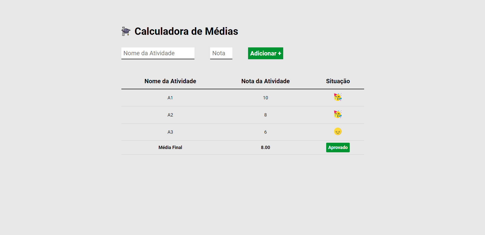

<h1 align="center">
  Calculadora de Médias Escolares
</h1>

## 📷 Deploy

<h3>LINK: https://calculadora-medias-hs.vercel.app/</h3>

## 💻 Projeto

Neste projeto realizado em aula, pratiquei o uso de HTML, CSS e JavaScript, para a criação de uma calculadora de médias escolares.

## 🚀 Tecnologias

- JavaScript
- HTML
- CSS

## 📝 Aprendizados

- [x] Uso do DOM com JavaScript
- [x] Uso de Arrays com JavaScript
